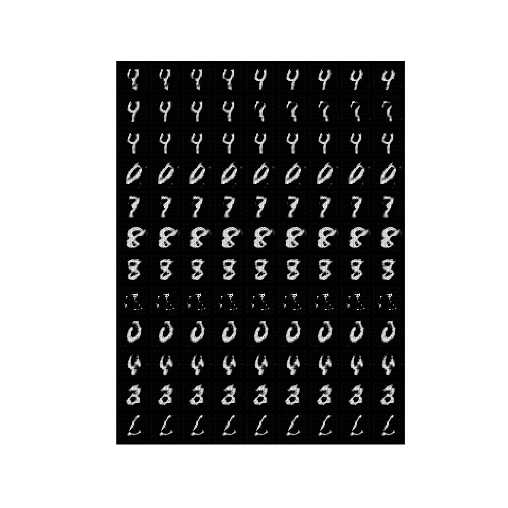

# InfoGAN-pytorch
This is the code for implementation of [InfoGAN](https://arxiv.org/pdf/1606.03657.pdf) written by pytorch.
It is completed on the MNIST dataset.

## Download Dataset
You download the MNIST dataset by this command.
```
python data/downloads.py
```

### Model archtecture
This below architecture is for the generator.
There are transposed convolutional networks and linear networks using batch normalization with ReLU activation function.


This below architecture is for the discriminator.
There are convolutional networks and linear networks using batch normalization with leakyReLU activation functions.


### Run the script
After you set the configuration of run script, run the script.
I did set the learning rate of generator and discriminator ten times less than original learning rate.
It was better to train the model.
```
sh run.sh
```

### Experiments
Generator is trained well like thie way.   


As manipulating the latent codes, I got this result.



